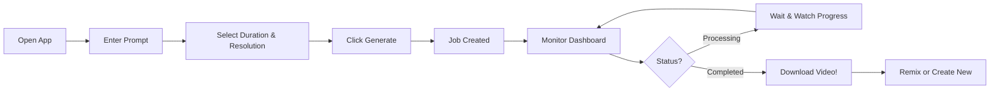

# 🎬 Sora Studio - OpenAI Video API Web Interface

<div align="center">


**A beautiful, modern web interface for generating AI videos with OpenAI's Sora API**

[Features](#-features) • [Quick Start](#-quick-start) • [Demo](#-how-it-works) • [Documentation](#-documentation)

---

</div>

## 📸 Screenshots

### 🎨 Create Tab - Generate Your Videos
```
┌─────────────────────────────────────────────────────────┐
│  Sora Studio                              ⚙️ Settings   │
├─────────────────────────────────────────────────────────┤
│  ➕ Create Video  │  📊 Dashboard  │  🖼️ Gallery      │
├─────────────────────────────────────────────────────────┤
│                                                           │
│  📝 Prompt:                                              │
│  ┌───────────────────────────────────────────────────┐  │
│  │ A golden retriever puppy playing in a field      │  │
│  │ of colorful wildflowers at sunset                │  │
│  └───────────────────────────────────────────────────┘  │
│                                                           │
│  🎬 Model: sora-2                                        │
│                                                           │
│  ⏱️ Duration:    [4s] [6s] [8s]                         │
│                                                           │
│  📐 Resolution:                                          │
│  ┌──────────┐ ┌──────────┐ ┌──────────┐ ┌──────────┐  │
│  │ Portrait │ │   Tall   │ │Landscape │ │   Wide   │  │
│  │ 720x1280 │ │1024x1808 │ │1280x720  │ │1808x1024 │  │
│  └──────────┘ └──────────┘ └──────────┘ └──────────┘  │
│                                                           │
│  📎 Optional Reference: [Upload Image/Video]             │
│                                                           │
│                         [🪄 Generate Video]              │
└─────────────────────────────────────────────────────────┘
```

### 📊 Dashboard - Monitor Progress
```
┌─────────────────────────────────────────────────────────┐
│  Video Jobs                    [Filter ▼] [Search] [🔄] │
├─────────────────────────────────────────────────────────┤
│  ⏱️ Auto-refreshing every 10 seconds  [⏸️ Pause]        │
├─────────────────────────────────────────────────────────┤
│                                                           │
│  🟢 completed   video_abc123                             │
│  "A golden retriever puppy playing..."                   │
│  📅 10/7/2025, 2:11 PM  │  🎬 8s  │  📐 1280x720        │
│  Progress: ████████████████████ 100%                     │
│  [👁️ Details] [⬇️ Download] [🎭 Remix] [🗑️ Delete]      │
│                                                           │
│  🔵 processing   video_xyz789                            │
│  "Ocean waves crashing..."                               │
│  📅 10/7/2025, 2:15 PM  │  🎬 6s  │  📐 720x1280        │
│  Progress: ████████░░░░░░░░░░░░ 45%                     │
│  [👁️ Details] [🗑️ Delete]                                │
│                                                           │
│  🟡 queued   video_def456                                │
│  "Time-lapse of clouds..."                               │
│  📅 10/7/2025, 2:16 PM  │  🎬 4s  │  📐 1024x1808       │
│  Progress: ░░░░░░░░░░░░░░░░░░░░ 0%                      │
│  [👁️ Details] [🗑️ Delete]                                │
│                                                           │
└─────────────────────────────────────────────────────────┘
```

### 🖼️ Gallery - Browse Your Creations
```
┌─────────────────────────────────────────────────────────┐
│  Completed Videos                      [📥 Export History]│
├─────────────────────────────────────────────────────────┤
│                                                           │
│  ┌──────────┐  ┌──────────┐  ┌──────────┐              │
│  │ 🎬 VIDEO │  │ 🎬 VIDEO │  │ 🎬 VIDEO │              │
│  │  PLAYS   │  │  PLAYS   │  │  PLAYS   │              │
│  │  ON LOAD │  │  ON LOAD │  │  ON LOAD │              │
│  ├──────────┤  ├──────────┤  ├──────────┤              │
│  │ Prompt:  │  │ Prompt:  │  │ Prompt:  │              │
│  │ A golden │  │ Ocean    │  │ Time-    │              │
│  │ retriever│  │ waves... │  │ lapse... │              │
│  │ 📅 10/7  │  │ 📅 10/7  │  │ 📅 10/7  │              │
│  │ 🎬 8s    │  │ 🎬 6s    │  │ 🎬 4s    │              │
│  │[⬇️][🎭]  │  │[⬇️][🎭]  │  │[⬇️][🎭]  │              │
│  └──────────┘  └──────────┘  └──────────┘              │
│                                                           │
│  ← Hover over videos to hear audio! →                    │
│  ← Click to view full details →                          │
└─────────────────────────────────────────────────────────┘
```

---

## ✨ Features

### 🎬 Video Generation
- **Text-to-Video** - Transform descriptions into videos
- **Multiple Durations** - Choose 4, 6, or 8 seconds
- **4 Resolutions** - Portrait, Landscape, and HD options
- **Reference Upload** - Guide generation with images/videos
- **Real-time Progress** - Watch your video generate live

### 📊 Dashboard
- **Auto-refresh** - Updates every 10 seconds automatically
- **Status Tracking** - Visual progress bars for each video
- **Filter & Search** - Find videos quickly
- **Bulk Actions** - Download, remix, or delete multiple videos

### 🖼️ Gallery
- **Instant Thumbnails** - See all videos in < 1 second
- **Auto-play Previews** - Videos load and play on hover
- **Audio on Hover** - Unmute by moving your mouse over
- **One-click Actions** - Download or remix directly

### 🎭 Remix Feature
- **Create Variations** - Build on successful generations
- **Prompt Evolution** - Extend or modify existing videos
- **Track History** - See which videos are remixes

### ⚙️ Settings
- **API Key Storage** - Persistent `.env` file support
- **Default Preferences** - Set preferred duration and resolution
- **Auto-refresh Control** - Customize update interval
- **Data Management** - Export or clear job history

---

## 🚀 Quick Start

### Prerequisites
- Modern web browser (Chrome, Firefox, Safari, Edge)
- OpenAI API key with Sora access
- Python 3 (for local server)

### Installation

**1️⃣ Clone the repository**
```bash
git clone https://github.com/yourusername/sora-studio.git
cd sora-studio
```

**2️⃣ Add your API key**
```bash
# Edit .env file
nano .env
```

Add your key:
```env
OPENAI_API_KEY=sk-your-api-key-here
```

**3️⃣ Start the server**
```bash
# Make script executable
chmod +x scripts/start-server.sh

# Start server
./scripts/start-server.sh
```

**4️⃣ Open in browser**
```
http://localhost:8000
```

That's it! 🎉

---

## 🎯 How It Works

### 1️⃣ Create a Video

```
You type a prompt → Click "Generate" → Job created
```

**Example Prompts:**
- "A golden retriever puppy playing in a field of flowers at sunset"
- "Ocean waves crashing against rocky cliffs during a storm"
- "Time-lapse of clouds moving across a vibrant sunset sky"

### 2️⃣ Monitor Progress

```
Dashboard shows:
├── 🟡 Queued (waiting to start)
├── 🔵 Processing (generating... 45%)
└── 🟢 Completed (ready to download!)
```

**Auto-refresh every 10 seconds** - No manual clicking needed!

### 3️⃣ Download & Enjoy

```
Video complete → Click "Download" → Save as MP4
```

Or **"Remix"** to create variations!

---

## 📖 Detailed Workflow

### Creating Your First Video



**Step-by-step:**

1. **Navigate to "Create Video" tab**
2. **Enter your prompt** - Be descriptive!
   ```
   Example: "A close-up shot of a hummingbird hovering near
   a red hibiscus flower in slow motion with morning sunlight"
   ```
3. **Choose settings:**
   - Duration: 4s (quick), 6s (standard), or 8s (extended)
   - Resolution: Portrait (9:16) or Landscape (16:9)
4. **Optional:** Upload reference image/video
5. **Click "Generate Video"**
6. **Switch to Dashboard** to monitor progress

---

## 🎨 API Integration

### Endpoints Used

| Endpoint | Purpose | When |
|----------|---------|------|
| `POST /videos` | Create video | User clicks "Generate" |
| `GET /videos/{id}` | Check status | Auto-refresh (every 10s) |
| `GET /videos` | List all videos | Dashboard load |
| `GET /videos/{id}/content` | Download video | User clicks "Download" |
| `POST /videos/{id}/remix` | Remix video | User clicks "Remix" |
| `DELETE /videos/{id}` | Delete video | User clicks "Delete" |

### Video Variants

```
variant=thumbnail  → Static image (instant load) 📸
variant=video      → Full MP4 file (for download) 🎬
variant=spritesheet → Preview frames (future use) 🎞️
```

---

## 🏗️ Architecture

### File Structure

```
sora-studio/
├── 📄 index.html              # Main UI (entry point)
├── 📄 .env                    # Your API key
├── 📄 README.md               # This file
│
├── 📁 src/                    # Source code
│   ├── app.js                 # Application logic (40 KB)
│   └── config.js              # Config loader (2 KB)
│
├── 📁 scripts/                # Utility scripts
│   └── start-server.sh        # Server startup
│
└── 📁 docs/                   # Documentation
    ├── START_HERE.md          # Quick start
    ├── SETUP.md               # Detailed setup
    └── openai-video-api-guide.md  # API reference
```

### Technology Stack

**Frontend:**
- HTML5 - Structure
- Tailwind CSS - Styling
- Vanilla JavaScript - Logic
- Font Awesome - Icons

**Backend:**
- Python HTTP Server - Local hosting
- OpenAI API - Video generation

**No framework needed!** Pure HTML/CSS/JS for simplicity.

---

## 🎯 Key Features Explained

### 🔄 Auto-Refresh

```javascript
// Every 10 seconds:
Check for active jobs (queued or processing)
↓
Fetch latest status from API
↓
Update UI automatically
↓
Show notification if completed
```

**Benefits:**
- ✅ No manual refresh needed
- ✅ Real-time progress updates
- ✅ Notifications when videos complete
- ✅ Configurable interval (5-60s)

---

### 🖼️ Gallery Optimization

```javascript
// Two-stage loading:
1. Load thumbnail (instant - 50KB)
   ↓ User sees content immediately
2. Load video in background (5-10MB)
   ↓ Ready when user hovers
3. Hover to play with audio
   ↓ Smooth playback, no delay
```

**Performance:**
- 📸 Thumbnails: < 1 second
- 🎬 Full videos: Background loading
- 🚀 20x faster than loading all videos upfront

---

### 🎭 Remix Feature

Create variations of successful videos:

```
Original prompt:
"A cat playing piano on stage"

Remix prompt:
"Same scene but now the cat takes a bow to a cheering audience"

Result:
→ New video building on the original!
```

---

## 📊 Status Indicators

| Status | Icon | Color | Meaning |
|--------|------|-------|---------|
| Queued | 🟡 | Yellow | Waiting to start |
| Processing | 🔵 | Blue | Generating video |
| Completed | 🟢 | Green | Ready to download |
| Failed | 🔴 | Red | Error occurred |
| Cancelled | ⚪ | Gray | Job cancelled |

---

## ⚙️ Configuration

### Environment Variables

```env
# .env file
OPENAI_API_KEY=sk-your-key-here
```

### Settings Panel

**Default Preferences:**
- Duration: 4, 6, or 8 seconds
- Resolution: 720x1280, 1024x1808, 1280x720, 1808x1024
- Auto-refresh interval: 5-60 seconds

**Data Management:**
- Export job history as JSON
- Clear all local data
- API key management

---

## 🔒 Security

### API Key Storage

```
Priority: .env file → localStorage

.env file (recommended):
- Stored locally
- Not committed to git (.gitignore)
- More secure for development

localStorage (fallback):
- Stored in browser
- Accessible to JavaScript
- Use .env instead
```

### Best Practices

✅ **Do:**
- Store API key in `.env` file
- Keep `.env` in `.gitignore`
- Use environment variables in production
- Implement backend proxy for public apps

❌ **Don't:**
- Commit API keys to GitHub
- Share your `.env` file
- Use client-side keys in production
- Store keys in plain text in code

---

## 🎓 Usage Tips

### Writing Great Prompts

**Good Prompt ✅**
```
A close-up shot of a hummingbird hovering near a red hibiscus
flower. The scene is shot in slow motion with morning sunlight
creating a soft glow. The background is a blurred garden.
```

**Bad Prompt ❌**
```
bird and flower
```

**Tips:**
- Be specific and descriptive
- Include details about lighting, mood, camera angles
- Mention movement and action
- Specify time of day or weather

---

### Optimizing for Speed

**For testing:**
- Use 4-second duration
- Use lower resolution (720x1280)
- Test prompts before full generation

**For final videos:**
- Use 8-second duration
- Use higher resolution (1808x1024)
- Generate after testing prompt

---

### Managing Videos

**Organization:**
- Delete old test videos
- Download important videos (they expire!)
- Use remix to iterate on good results
- Export history for backup

---

## 🐛 Troubleshooting

### Common Issues

**1. API Key Not Working**
```bash
# Check your key
cat .env

# Should show: OPENAI_API_KEY=sk-...
# If empty, add your key
```

**2. Server Won't Start**
```bash
# Make script executable
chmod +x scripts/start-server.sh

# Or run manually
python3 -m http.server 8000
```

**3. Videos Not Auto-Refreshing**
```javascript
// Open browser console (F12)
// You should see:
🔍 Checking jobs... Total: 1, Active: 1
📡 Fetching latest status for video_xxx...
✅ Auto-refresh complete
```

**4. Download Fails**
```
Error: Invalid value: 'mp4'
Solution: Already fixed! Refresh your browser.
```

**5. Gallery Loads Slowly**
```
Expected: Thumbnails show in < 1 second
If slow: Check internet connection
Tip: Videos load in background, give it time
```

---

## 📚 Documentation

| Document | Description |
|----------|-------------|
| [START_HERE.md](docs/START_HERE.md) | Quick start guide |
| [SETUP.md](docs/SETUP.md) | Detailed setup instructions |
| [openai-video-api-guide.md](docs/openai-video-api-guide.md) | Complete API reference |
| [DIRECTORY_STRUCTURE.md](DIRECTORY_STRUCTURE.md) | Folder organization guide |
| [FIXES.md](docs/FIXES.md) | Bug fixes changelog |

---

## 🤝 Contributing

Contributions are welcome! Please feel free to submit a Pull Request.

**How to contribute:**
1. Fork the repository
2. Create your feature branch (`git checkout -b feature/AmazingFeature`)
3. Commit your changes (`git commit -m 'Add some AmazingFeature'`)
4. Push to the branch (`git push origin feature/AmazingFeature`)
5. Open a Pull Request

---

## 📋 Roadmap

### Planned Features

- [ ] Dark mode
- [ ] Video thumbnail generation
- [ ] Batch prompt upload (CSV)
- [ ] Video comparison view
- [ ] Custom resolution support
- [ ] Progress notifications (desktop)
- [ ] Video editing capabilities
- [ ] Collaborative projects
- [ ] Cloud storage integration
- [ ] Mobile app (React Native)

---

## 📄 License

This project is licensed under the MIT License - see the [LICENSE](LICENSE) file for details.

---

## 🙏 Acknowledgments

- **OpenAI** - For the amazing Sora API
- **Tailwind CSS** - For beautiful styling
- **Font Awesome** - For awesome icons
- **You!** - For using Sora Studio

---

## 📞 Support

**Issues?**
- Open an issue on [GitHub Issues](https://github.com/yourusername/sora-studio/issues)
- Check [Troubleshooting](#-troubleshooting) section
- Read the [docs](docs/)

**Questions?**
- Check [OpenAI Documentation](https://platform.openai.com/docs)
- Visit [OpenAI Community](https://community.openai.com)

---

## 🌟 Show Your Support

Give a ⭐️ if this project helped you!

---

<div align="center">

**Made with ❤️ for video creators**

[](https://github.com/yourusername/sora-studio/stargazers)
[](https://github.com/yourusername/sora-studio/network/members)

[⬆ Back to Top](#-sora-studio---openai-video-api-web-interface)

</div>
